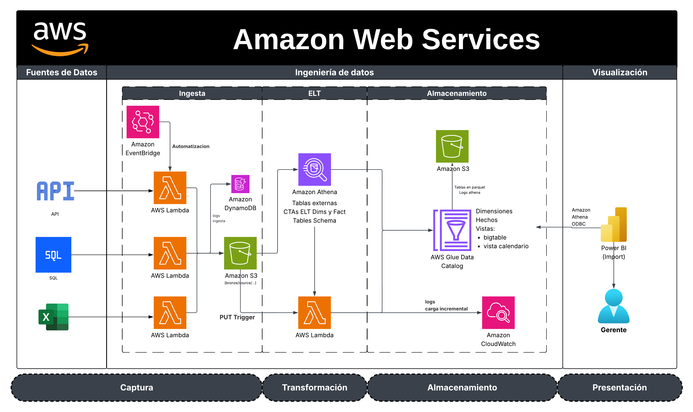
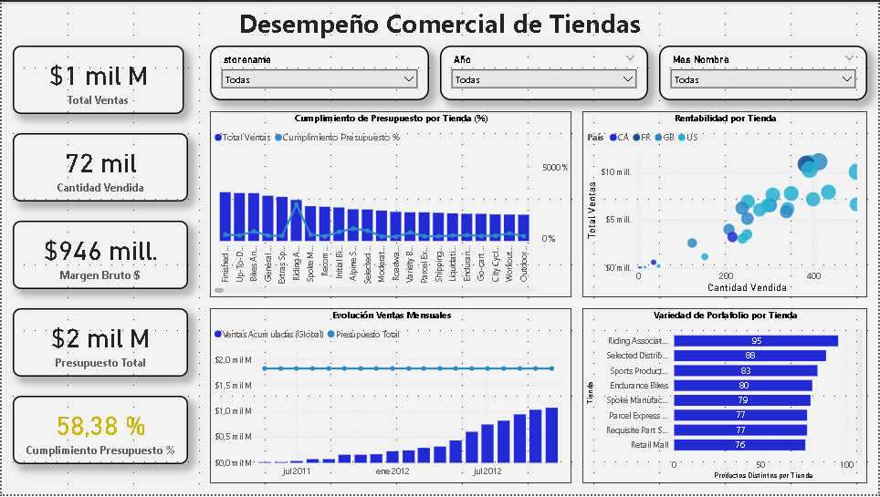

**Autor:** Bryan Gustavo Guapulema Arellano  
**Plataforma:** Amazon Web Services (AWS)  
**Periodo analizado:** Mayo 2011 — Mayo 2014  

---
## Descripción del proyecto

Adventure Works Analytics es una solución completa de **Inteligencia de Negocios** desarrollada sobre la nube de **AWS**, diseñada para analizar el desempeño comercial de *Adventure Works Cycles*, una empresa manufacturera y distribuidora de productos de ciclismo.

El proyecto implementa un **pipeline automatizado end-to-end**, desde la extracción de datos de múltiples fuentes (GitHub, MySQL y Excel) hasta la visualización de indicadores gerenciales en Power BI.  
Incluye un proceso de **carga incremental mensual**, registro de logs en **DynamoDB**, almacenamiento estructurado en **S3**, y transformación SQL serverless con **Athena**.

---

## Arquitectura general


---

## Herramientas y servicios utilizados
- **Servicio** / Herramienta|	Rol	|Función principal|
- Amazon S3	Almacenamiento	Data Lake estructurado (CSV y Parquet)
- AWS Lambda	Automatización	Ingesta, transformación y upsert incremental
- Amazon Athena	SQL serverless	Transformaciones ELT y creación de vistas
- AWS Glue Data Catalog	Metadatos	Definición de estructuras dim/fact/vistas
- Amazon DynamoDB	Control	Registro de logs, errores y ejecuciones
- Amazon CloudWatch	Observabilidad	Logs y trazabilidad de funciones Lambda
- Amazon EventBridge	Orquestación	Ejecución diaria de ingest_csv_github
- AWS IAM	Seguridad	Control de roles y políticas de acceso mínimo
- Power BI Desktop	Visualización	Conexión a Athena, modelo Import, DAX

---
## Metodología y desarrollo

#### 1️⃣ Estructura del Data Lake (S3)

- Bucket: bg-hack2-aw-datalake2

- Estructura modular:

```text
bronze/
  source=github/
  source=mysql/
  source=excel/
  source_metadata/sources.json
warehouse/
logs/athena-results/
```

#### 2️⃣ Servicios de soporte

- Secrets Manager: credenciales MySQL seguras (hack2/mysql/stores).

- DynamoDB: tablas etl_control y etl_error_logs para auditoría.

- Athena: consultas ELT y vistas; resultados en logs/athena-results/.

#### 3️⃣ Ingesta inicial

- Tres Lambdas independientes:
    - ingest_csv_github → carga CSV desde GitHub.

    - ingest_mysql_stores → conexión RDS pública (Stores).

    - ingest_excel_storesBudget → carga presupuestos.

#### 4️⃣ ETL y modelado

- Tablas externas ext_* definidas en Athena.

- Tablas destino dim_* y fact_sales en Glue Catalog.

- Transformaciones con CTAS → salida Parquet en warehouse/.

#### 5️⃣ Carga incremental automatizada

- Lambda: h2-factsales-upsert-month --> Ejecuta INSERT INTO fact_sales al detectar un nuevo mes (orders_YYYY-MM.csv).

- Trigger S3: ejecuta la Lambda automáticamente al crear el archivo.

- Scheduler: h2-scheduler-next-month calcula el siguiente mes y llama a ingest_csv_github.

- EventBridge Rule: cron cron(0 2 * * ? *) (21:00 Guayaquil) ejecuta el scheduler diario.

#### 6️⃣ Vistas analíticas (Athena)

- v_sales → hecho + dimensiones principales.

- v_dim_store → tiendas con presupuesto acumulado.

- v_calendar_month_loaded → calendario dinámico con meses cargados.

---
## Visualización

#### Conexión:
- Power BI ↔ Athena (ODBC Import): DSN configurado con credenciales IAM y acceso a S3/Glue/Athena.

#### Modelo:
Basado en tres vistas: v_sales, v_dim_store, v_calendar_month_loaded.

#### Principales medidas DAX:

- Total Ventas = SUM(v_sales[totaldue])

- Cumplimiento Presupuesto % = DIVIDE([Total Ventas], [Presupuesto Total])

- Ventas Acumuladas = CALCULATE([Total Ventas], FILTER(ALL(Calendario), Calendario[MonthDate] <= MAX(Calendario[MonthDate])))

#### Dashboard:


---
## Resultados del dashboard

- Ventas totales: $1.000M

- Cumplimiento promedio de presupuesto: 58.4%

- Unidades vendidas: 72K

- Margen bruto: $946M

- Hallazgos clave:

- Desbalance en metas por tienda (algunas sobrecumplen +500%, otras <10%).

- Mayor rentabilidad concentrada en EE.UU.

- Portafolio más diverso → mayores ventas.

- Recomendación: ajustar presupuestos por potencial real y catálogo.

---
## Mejores prácticas implementadas

- Bloqueo público y cifrado SSE-S3 en S3.

- Registro de logs centralizado (CloudWatch + DynamoDB).

- Estructura modular y versionada por mes (orders_YYYY-MM.csv).

- Servicios 100% serverless (sin EC2 ni Glue Crawlers).

- Uso de Parquet + Snappy para consultas eficientes y baratas.

- Automatización completa con S3 Triggers + EventBridge.

- Modelo Import en Power BI para velocidad y estabilidad.

- Proyecto ejecutado totalmente en el Free Tier AWS.

---
## Recursos

- Repositorio principal: Hackaton-2 (AWS AdventureWorks)

- [Datos fuente CSV/Excel:(https://github.com/BryanGuapulema/AW_data_csv)]

---
## Conclusión

Este proyecto demuestra la integración completa de un Data Lakehouse en AWS, aplicando prácticas reales de Data Engineering y Business Intelligence: extracción multi-fuente, transformación serverless, carga incremental y visualización analítica optimizada.
El resultado es un sistema automatizado, escalable y trazable, con un dashboard gerencial que potencia la toma de decisiones estratégicas para Adventure Works.

---